# 搭建个人博客-ReadtheDocs

基于Markdown+Pandoc+Sphinx + GitHub + Read the Docs 搭建个人博客，管理个人技术文章。

- Markdown：书写文档
- Pandoc：格式转化
- Sphinx：生成网页
- GitHub：托管项目
- ReadtheDocs：发布网页


## Sphinx安装及配置

### 安装Sphinx

` pip install sphinx sphinx-autobuild sphinx_rtd_theme`

创建一个工程目录myblog，在命令行界面下执行`sphinx-quickstart`进行配置：

```powershell
PS C:\Users\xushuai\Documents\myblog> sphinx-quickstart
Welcome to the Sphinx 7.3.7 quickstart utility.

Please enter values for the following settings (just press Enter to
accept a default value, if one is given in brackets).

Selected root path: .

You have two options for placing the build directory for Sphinx output.
Either, you use a directory "_build" within the root path, or you separate
"source" and "build" directories within the root path.
> Separate source and build directories (y/n) [n]:	# 默认不分离source 和 build 目录

The project name will occur in several places in the built documentation.
> Project name: lldhsds's Blog
> Author name(s): lldhsds
> Project release []: 1.0

If the documents are to be written in a language other than English,
you can select a language here by its language code. Sphinx will then
translate text that it generates into that language.

For a list of supported codes, see
https://www.sphinx-doc.org/en/master/usage/configuration.html#confval-language.
> Project language [en]: zh_CN

Creating file C:\Users\xushuai\Documents\myblog\conf.py.
Creating file C:\Users\xushuai\Documents\myblog\index.rst.
Creating file C:\Users\xushuai\Documents\myblog\Makefile.
Creating file C:\Users\xushuai\Documents\myblog\make.bat.

Finished: An initial directory structure has been created.

You should now populate your master file C:\Users\xushuai\Documents\myblog\index.rst and create other documentation
source files. Use the Makefile to build the docs, like so:
   make builder
where "builder" is one of the supported builders, e.g. html, latex or linkcheck.

PS C:\Users\xushuai\Documents\myblog> tree /F
文件夹 PATH 列表
卷序列号为 4840-DDCE
C:.
│  conf.py
│  index.rst
│  make.bat
│  Makefile
│
├─_build
├─_static
└─_templates
```

后续文章配置过程中，选择分离source 和 build 目录：

```powershell
PS C:\Users\xushuai\Documents\mydoc> sphinx-quickstart
Welcome to the Sphinx 7.3.7 quickstart utility.

Please enter values for the following settings (just press Enter to
accept a default value, if one is given in brackets).

Selected root path: .

You have two options for placing the build directory for Sphinx output.
Either, you use a directory "_build" within the root path, or you separate
"source" and "build" directories within the root path.
> Separate source and build directories (y/n) [n]: y	# 分离source 和 build 目录

The project name will occur in several places in the built documentation.
> Project name: mydoc
> Author name(s): lldhsds
> Project release []: 1.0

If the documents are to be written in a language other than English,
you can select a language here by its language code. Sphinx will then
translate text that it generates into that language.

For a list of supported codes, see
https://www.sphinx-doc.org/en/master/usage/configuration.html#confval-language.
> Project language [en]: zh_CN

Creating file C:\Users\xushuai\Documents\mydoc\source\conf.py.
Creating file C:\Users\xushuai\Documents\mydoc\source\index.rst.
Creating file C:\Users\xushuai\Documents\mydoc\Makefile.
Creating file C:\Users\xushuai\Documents\mydoc\make.bat.

Finished: An initial directory structure has been created.

You should now populate your master file C:\Users\xushuai\Documents\mydoc\source\index.rst and create other documentation
source files. Use the Makefile to build the docs, like so:
   make builder
where "builder" is one of the supported builders, e.g. html, latex or linkcheck.

PS C:\Users\xushuai\Documents\mydoc> tree /F
文件夹 PATH 列表
卷序列号为 4840-DDCE
C:.
│  make.bat
│  Makefile
│
├─build
└─source
    │  conf.py
    │  index.rst
    │
    ├─_static
    └─_templates
```

- build:  文件夹，当你执行make html的时候，生成的html静态文件都存放在这里。
- source:  文件夹,   你的文档源文件全部应全部放在source根目录下。
- Makefile:   编译文件，用于编译生成静态html
- make.bat:   bat脚本文件

sphinx相关命令会安装到python的Scripts文件夹下。如果windows下运行找不到命令，可以检查环境变量是否配置。


### 配置及扩展

Sphinx 的配置文件是 source\conf.py，修改如下：

```python
# Configuration file for the Sphinx documentation builder.
#
# For the full list of built-in configuration values, see the documentation:
# https://www.sphinx-doc.org/en/master/usage/configuration.html

import recommonmark
import myst_parser

# -- Project information -----------------------------------------------------
# https://www.sphinx-doc.org/en/master/usage/configuration.html#project-information

project = 'mydoc'
copyright = '2024, lldhsds'
author = 'lldhsds'
release = '1.0'

# -- General configuration ---------------------------------------------------
# https://www.sphinx-doc.org/en/master/usage/configuration.html#general-configuration

extensions = [
    # 'recommonmark',
    'sphinx_markdown_tables',
    'myst_parser'
]

templates_path = ['_templates']
exclude_patterns = []

language = 'zh_CN'

source_suffix = {
    '.rst': 'restructuredtext',
    '.md': 'markdown'
}

math_number_all = True

# -- Options for HTML output -------------------------------------------------
# https://www.sphinx-doc.org/en/master/usage/configuration.html#options-for-html-output

html_theme = 'sphinx_rtd_theme'
html_static_path = ['_static']
```

- import: 两个用于解析markdown文件的扩展。
- extensions: 参照上述`import`进行扩展说明。
- source_suffix: 添加相应后缀，包括`.rst`和`.md`。
- math_number_all: 用于页面中嵌入公式。
- html_theme: 网页风格，修改可以参见[官方文档](https://www.sphinx-doc.org/en/master/usage/theming.html#builtin-themes)


安装扩展模块：

` pip install recommonmark myst_parser`


## 撰写文章

在source目录下，新增文章，如`Python编程语言简明指南.rst`，文件内容如下：

```reStructuredText
===============================
Python 编程语言：简明指南
===============================

Python 是一种高层次的、解释型的编程语言，以其简单易读的语法和强大的功能而闻名。本文将介绍 Python 的一些基本概念和功能。

.. contents::
   :local:
   :depth: 2

Python 简介
============

Python 由 Guido van Rossum 在 1980 年代后期创建，并在 1991 年首次发布。它的设计哲学强调代码的可读性，并使用显式的语法来表达程序的逻辑。

历史背景
---------

Python 的名字来源于喜剧团体 Monty Python。与其名字相反，Python 并不是一门玩笑语言，而是一门广泛应用于各个领域的严肃编程语言。

特点
-----

Python 有以下主要特点：

- 简洁明了的语法
- 丰富的标准库和第三方模块
- 强大的社区支持
- 跨平台兼容性

安装和设置
============

安装 Python 非常简单，你可以从官方 `Python 网站 <https://www.python.org>`_ 下载适用于不同操作系统的安装包。

代码示例
--------

以下是一个简单的 Python 代码示例：

.. code-block:: python

    def hello_world():
        print("Hello, World!")

    if __name__ == "__main__":
        hello_world()

常用数据类型
=============

Python 支持多种数据类型，包括：

整数
----

整数（`int`）是一种基本数据类型，用于表示没有小数部分的数值。

浮点数
------

浮点数（`float`）用于表示带有小数部分的数值。

字符串
------

字符串（`str`）用于表示文本数据。你可以使用单引号或双引号定义字符串。

.. code-block:: python

    message = "Hello, Python!"

列表
----

列表（`list`）是一种有序的可变集合，使用方括号表示。

.. code-block:: python

    fruits = ["apple", "banana", "cherry"]

字典
----

字典（`dict`）是一种无序的键值对集合，使用大括号表示。

.. code-block:: python

    person = {"name": "John", "age": 30}

条件语句和循环
================

条件语句
---------

使用 `if`、`elif` 和 `else` 可以实现条件判断。

.. code-block:: python

    x = 10
    if x < 0:
        print("负数")
    elif x == 0:
        print("零")
    else:
        print("正数")

循环
-----

Python 支持 `for` 循环和 `while` 循环。

.. code-block:: python

    # for 循环
    for i in range(5):
        print(i)

    # while 循环
    count = 0
    while count < 5:
        print(count)
        count += 1

模块和包
========

模块
-----

模块是包含 Python 代码的文件，可以使用 `import` 语句导入模块。

.. code-block:: python

    import math
    print(math.sqrt(16))

包
---

包是包含多个模块的文件夹，通常包含一个 `__init__.py` 文件。

.. _external-link:

更多资源
========

- 官方文档：`Python 文档 <https://docs.python.org>`_
- 社区论坛：`Python 论坛 <https://python-forum.io>`_

结论
====

Python 是一门功能强大且易于学习的编程语言，适合从初学者到专家的各类编程任务。

.. note::

   学习编程是一段旅程，享受编程的乐趣，持续学习和实践，你会成为一名优秀的程序员。

.. tip::

   多练习写代码，多阅读官方文档和优秀的开源项目，有助于提高编程技能。

.. warning::

   编程过程中注意备份代码，以防数据丢失。

**加粗文本示例** 和 *斜体文本示例*。

- 项目一
- 项目二

1. 第一点
2. 第二点

这是一个引用::

    "这是一段引用文本。"

这是一个注脚示例 [#]_。

.. [#] 注脚内容。

再见！

.. image:: https://www.python.org/static/community_logos/python-logo-master-v3-TM.png
   :alt: Python 标志
   :width: 200px
```


说明：

Sphinx的文档格式，默认是 rst 格式，如果你习惯了使用Markdown来写文章，可以使用 Pandoc 这个神器转换一下。转换命令如下：

```
pandoc -V mainfont="SimSun" -f markdown -t rst hello.md -o hello.rst
```

或者你也可以在 Sphinx 上添加支持 Markdown 渲染的扩展模块。


文档编写完成后，更新排版文件source\index.rst，增加刚才写的文档：

```reStructuredText
.. mydoc documentation master file, created by
   sphinx-quickstart on Mon May 20 11:45:57 2024.
   You can adapt this file completely to your liking, but it should at least
   contain the root `toctree` directive.

Welcome to mydoc's documentation!
=================================

.. toctree::
   :maxdepth: 2
   :caption: Contents:

   Python编程语言简明指南

Indices and tables
==================

* :ref:`genindex`
* :ref:`modindex`
* :ref:`search`
```

然后执行make html 生成html静态文件：

```powershell
PS C:\Users\xushuai\Documents\mydoc> .\make.bat html
Running Sphinx v7.3.7
loading translations [zh_CN]... done
making output directory... done
building [mo]: targets for 0 po files that are out of date
writing output...
building [html]: targets for 2 source files that are out of date
updating environment: [new config] 2 added, 0 changed, 0 removed
reading sources... [100%] index
looking for now-outdated files... none found
pickling environment... done
checking consistency... done
preparing documents... done
copying assets... copying static files... done
copying extra files... done
done
writing output... [100%] index
generating indices... genindex done
writing additional pages... search done
dumping search index in Chinese (code: zh)... done
dumping object inventory... done
build succeeded.

The HTML pages are in build\html.
```

执行完成后查看build文件夹：

```powershell
PS C:\Users\xushuai\Documents\mydoc> tree /F .\build\
文件夹 PATH 列表
卷序列号为 4840-DDCE
C:\USERS\XUSHUAI\DOCUMENTS\MYDOC\BUILD
├─doctrees
│      environment.pickle
│      index.doctree
│      Python编程语言简明指南.doctree
│
└─html
    │  .buildinfo
    │  genindex.html
    │  index.html
    │  objects.inv
    │  Python编程语言简明指南.html
    │  search.html
    │  searchindex.js
    │
    ├─_sources
    │      index.rst.txt
    │      Python编程语言简明指南.rst.txt
    │
    └─_static
            alabaster.css
            basic.css
            custom.css
            doctools.js
            documentation_options.js
            file.png
            language_data.js
            minus.png
            plus.png
            pygments.css
            searchtools.js
            sphinx_highlight.js
            translations.js
```


使用浏览器打开 build\html\ 目录下的index.html文件，效果如下：

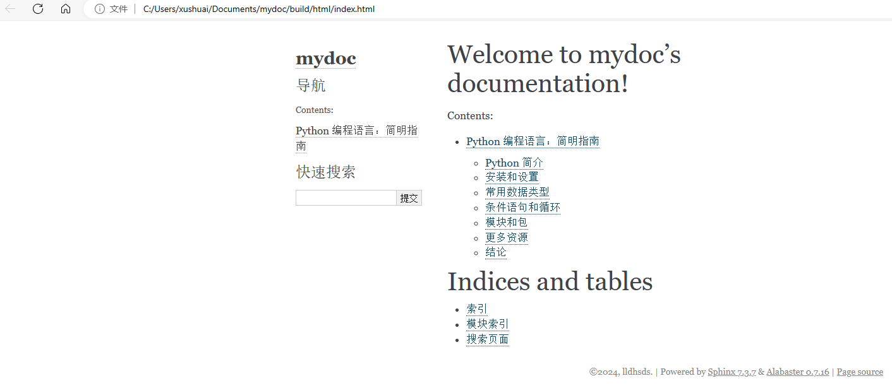

## GitHub托管

目前网页只是在本地，将站点发布到线上。先将`mydoc`工程文件托管到`github`仓库，然后由`Read the Docs`发布。


在`mydoc`根目录下，添加`.gitignore`文件，添加要忽略管理的文件：

```txt
build/
.idea/
*.pyc
```

接下来，在你的GitHub上新建一个仓库。然后把`mydoc`这个目录下的所有文件都提交上去。Github创建仓库后会给出两种推送文件的方式。

1. 从命令行创建一个仓库：

```sh
echo "# mydoc" >> README.md
git init
git add .
git commit -m "first commit"
git branch -M main
git remote add origin https://github.com/lldhsds/mydoc.git
git push -u origin main
```

2. 推送一个已经存在的仓库：

```shell
git remote add origin https://github.com/lldhsds/mydoc.git
git branch -M main
git push -u origin main
```

我这里选择方式1：

```powershell
PS C:\Users\xushuai\Documents\mydoc> git push -u origin main
fatal: unable to access 'https://github.com/lldhsds/mydoc.git/': SSL certificate problem: unable to get local issuer certificate
# 遇到上面的错误，关闭ssl
PS C:\Users\xushuai\Documents\mydoc> git config --global http.sslVerify false
PS C:\Users\xushuai\Documents\mydoc> git push -u origin main
warning: ----------------- SECURITY WARNING ----------------
warning: | TLS certificate verification has been disabled! |
warning: ---------------------------------------------------
warning: HTTPS connections may not be secure. See https://aka.ms/gcm/tlsverify for more information.
info: please complete authentication in your browser...
warning: ----------------- SECURITY WARNING ----------------
warning: | TLS certificate verification has been disabled! |
warning: ---------------------------------------------------
warning: HTTPS connections may not be secure. See https://aka.ms/gcm/tlsverify for more information.
Enumerating objects: 11, done.
Counting objects: 100% (11/11), done.
Delta compression using up to 8 threads
Compressing objects: 100% (9/9), done.
Writing objects: 100% (11/11), 8.97 KiB | 4.49 MiB/s, done.
Total 11 (delta 0), reused 0 (delta 0), pack-reused 0
To https://github.com/lldhsds/mydoc.git
 * [new branch]      main -> main
branch 'main' set up to track 'origin/main'.
```

## 发布上线

托管完成后，我们要发布它，让别人也可以使用公网访问。你需要先去 [Read the Docs](https://readthedocs.org/dashboard/) 注册下帐号。

注册后登录，选择导入一个项目：

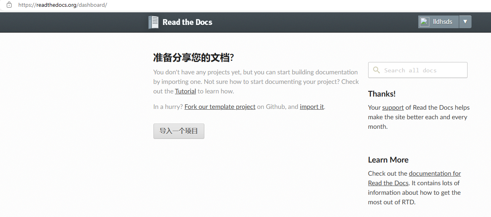

导入代码库，选择`Connect to GitHub`，加载github仓库列表后，选择上面创建的`mydoc`:

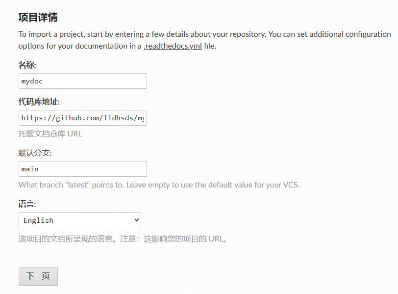

如果无法加载github仓库列表，可以选择手动导入：

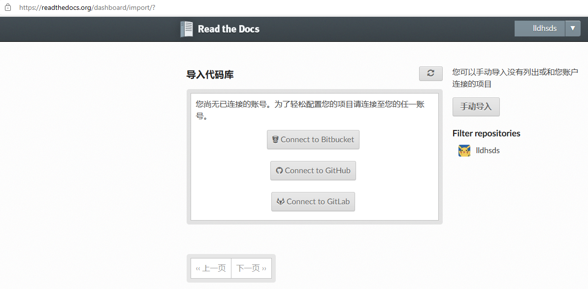


因为名称mydoc已经存在，这里我换一个名字，同时修改语言：

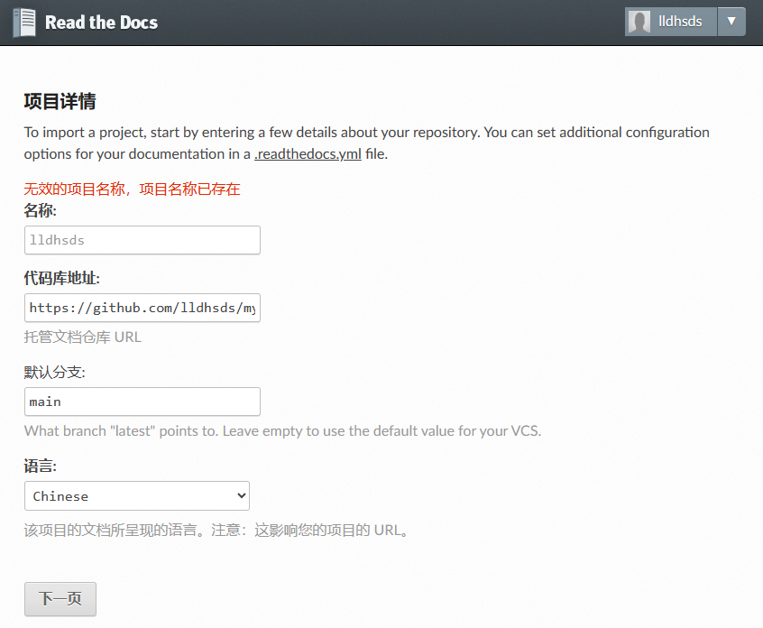

提醒添加配置文件：

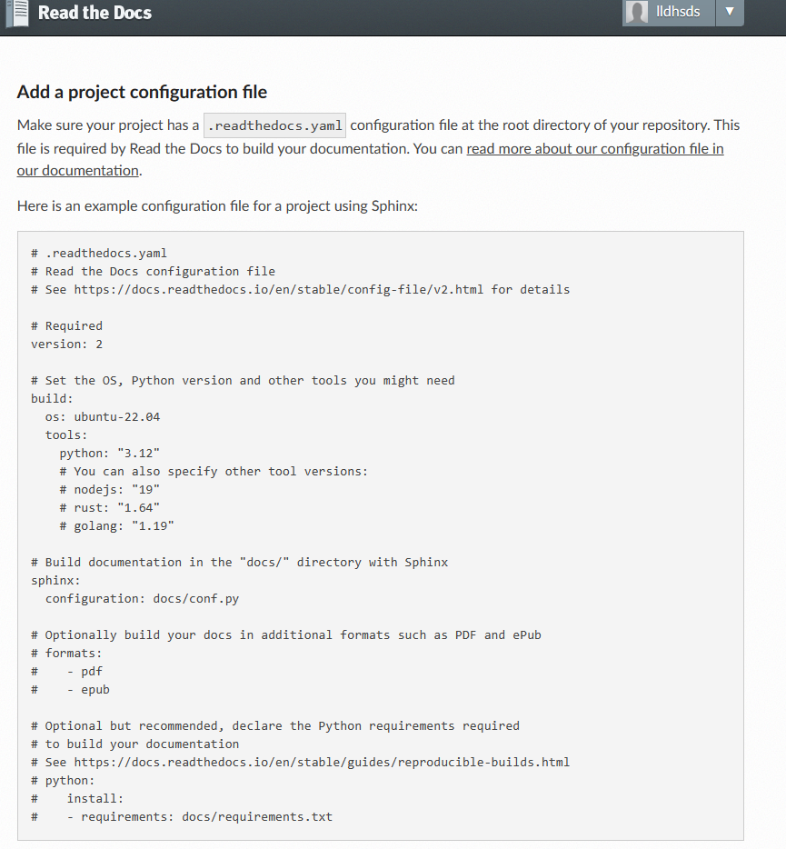

在mydoc目录下创建文件`.readthedocs.yaml`，复制上面的内容。修改如下两个地方：

- build过程使用的python版本，保持和本地python版本一致：`python: "3.10"`

- `sphinx`配置文件路径为：`configuration: source/conf.py`：

```yaml
# .readthedocs.yaml
# Read the Docs configuration file
# See https://docs.readthedocs.io/en/stable/config-file/v2.html for details

# Required
version: 2

# Set the OS, Python version and other tools you might need
build:
  os: ubuntu-22.04
  tools:
    python: "3.10"
    # You can also specify other tool versions:
    # nodejs: "19"
    # rust: "1.64"
    # golang: "1.19"

# Build documentation in the "docs/" directory with Sphinx
sphinx:
  configuration: source/conf.py

# Optionally build your docs in additional formats such as PDF and ePub
# formats:
#    - pdf
#    - epub

# Optional but recommended, declare the Python requirements required
# to build your documentation
# See https://docs.readthedocs.io/en/stable/guides/reproducible-builds.html
# python:
#    install:
#    - requirements: docs/requirements.txt
```


并将文件推送到仓库。

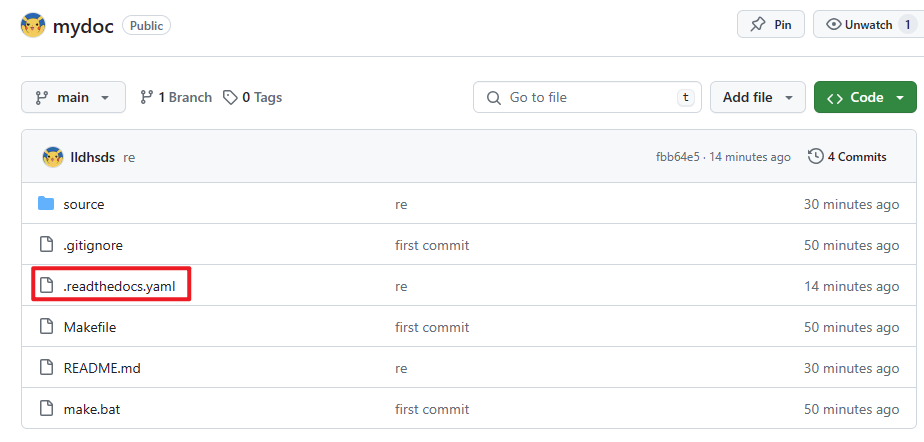


构建版本，右下角可以看到博客在线地址。：

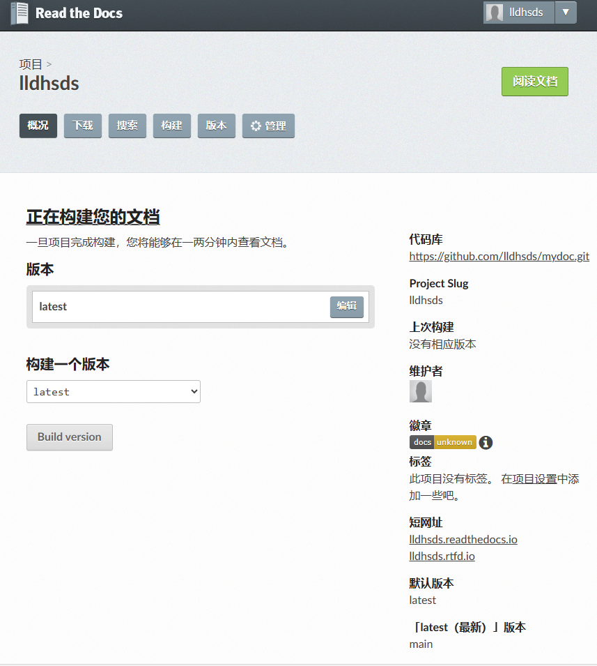


如果没有添加`.readthedocs.yaml`，构建会提示找不到该文件：

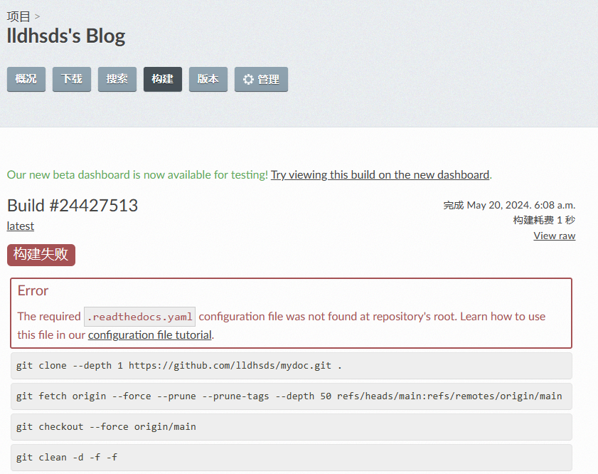


如果构建失败，请按照错误修改后，重新发起构建流程即可。构建完成的状态如下：

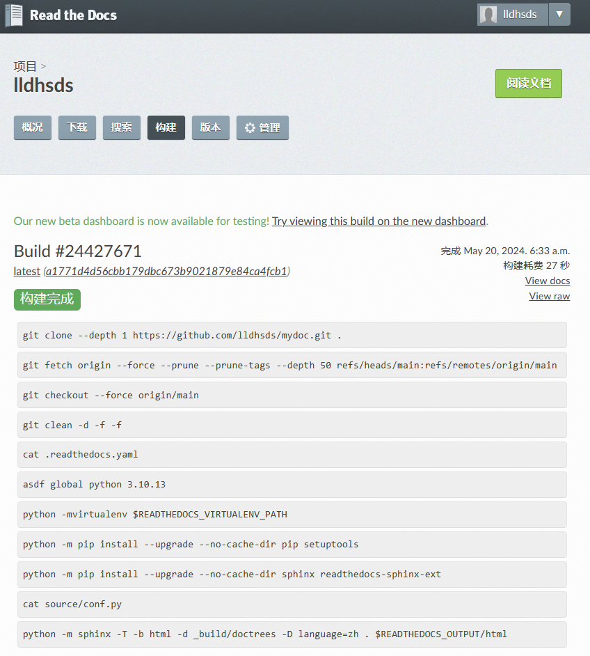

查看文档，如下图可以看到博客站点已经发布到在线的平台：

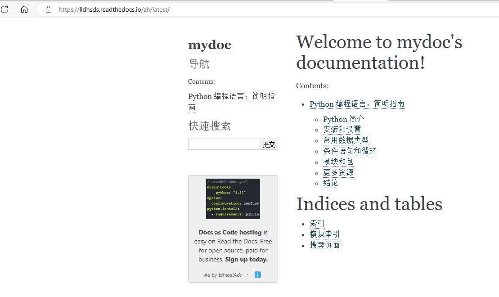

## 站点管理

可以在提供的管理面包中进行站点管理，包括设置名称、代码库对接、重新配置等。如果需要重新创建站点，可以在管理中删除站点后重新进行发布上线动作。


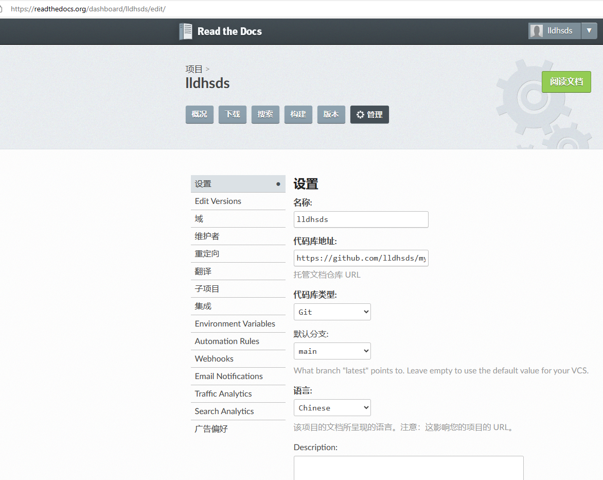


## 参考资料

[Sphinx + Read the Docs 从懵逼到入门 - 知乎 (zhihu.com)](https://zhuanlan.zhihu.com/p/264647009)

[pycharm-guide](https://github.com/iswbm/pycharm-guide)
