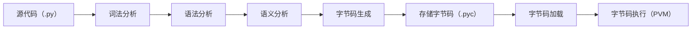

# Python简介

## 1. Python定义

Python 是一种简单易学并且结合了**解释性、编译性、互动性和面向对象的脚本语言**。Python提供了高级数据结构，它的语法和动态类型以及解释性使它成为广大开发者的首选编程语言。

- **Python 是解释型语言：** 开发过程中没有了编译这个环节。类似于PHP和Perl语言。

- **Python 是交互式语言：** 可以在一个 Python 提示符 >>> 后直接执行代码。

- **Python 是面向对象语言:** Python支持面向对象的风格或代码封装在对象的编程技术。

Python的创始人为Guido van Rossum。1989年，Guido为了打发圣诞节的无趣，决心开发一个新的脚本解释程序，做为ABC 语言的一种继承。

## 2.  Python发展史

### 2.1 Python发展史

1. **1980年代末**：
   - Guido van Rossum在荷兰阿姆斯特丹的CWI（Centrum Wiskunde & Informatica）工作，开始设计Python语言，灵感来自于ABC语言和其他语言如C、Unix shell。

2. **1991年**：
   - Python第一个版本（0.9.0）发布，包含了很多现代Python的基本特性，如异常处理、函数、模块、以及一些内置数据类型。

3. **1994年**：
   - Python 1.0发布，增加了lambda、map、filter、reduce等功能。

4. **2000年**：
   - Python 2.0发布，引入了列表解析、垃圾回收机制、以及Unicode支持。

5. **2008年**：
   - Python 3.0发布，这是一个不向后兼容的版本，引入了许多改进，如print函数、整数除法、文本和数据的更明确区分等。

### 2.2 主要版本

1. **Python 1.x 系列**：
   - **Python 1.0**（1994年）：引入了模块、异常、函数、以及核心数据类型如列表和字典。
   - **Python 1.5**（1998年）：引入了许多新特性，包括嵌套作用域和标准库的扩展。

2. **Python 2.x 系列**：
   - **Python 2.0**（2000年）：引入了垃圾回收机制、列表解析、Unicode支持等。
   - **Python 2.7**（2010年）：作为2.x系列的最后一个主要版本，增加了一些3.x的特性，如新格式化字符串语法（`str.format`）和字典理解（dictionary comprehensions）。

3. **Python 3.x 系列**：
   - **Python 3.0**（2008年）：这是一个不向后兼容的版本，引入了许多改进和新特性，如print函数、整数除法、更明确的文本和数据区分、以及重新设计的标准库。
   - **Python 3.6**（2016年）：引入了格式化字符串字面值（f-strings）、异步生成器和异步推导式。
   - **Python 3.7**（2018年）：引入了数据类（dataclasses）、上下文变量、改进的模块导入机制等。
   - **Python 3.8**（2019年）：引入了赋值表达式（walrus operator `:=`）、位置仅参数等。
   - **Python 3.9**（2020年）：引入了字典合并运算符（`|` 和 `|=`）、类型提示的改进等。
   - **Python 3.10**（2021年）：引入了结构模式匹配（Structural Pattern Matching）、改进的错误消息等。
   - **Python 3.11**（2022年）：引入了新的性能优化、改进的错误处理等。

### 2.3  Python2.0与Python3.0的区别


| **类别**            | **Python 2.0**                                                                                  | **Python 3.0**                                             |
|---------------------|-------------------------------------------------------------------------------------------------|------------------------------------------------------------|
| 输出方面            | 使用`print`关键字进行输出，例如：`print "Hello"`                                                | 使用`print()`函数，例如：`print("Hello")`                          |
| 输入方面            | 使用`raw_input()`函数，例如：`name = raw_input("请输入你的名字：")`                               | 使用`input()`函数，例如：`name = input("请输入你的名字：")`                |
| 字符串的编码格式    | 默认采用ASCII编码对输入的字符串进行编码                                                          | 默认采用Unicode编码对字符串进行编码                                      |
| 格式化字符串的方式  | 用`%`占位符进行标准化格式输出字符串，例如：“`Hello, %s" % ("World")`                             | 兼容2.0的语法外，还可以用`format()`函数，例如：“`Hello, {}.format("World")` |
| 源文件的编码格式    | 默认采用ASCII，因此使用中文时要在源文件开头加上一行注释：`# -- coding: utf-8 --`                  | 默认采用utf-8                                                  |
| 数据类型            | 有整型`int`、长整型`long`                                                                        | 只有整型`int`                                                  |
| 代码规范            | 源码不规范，重复代码很多                                                                        | 源码精简，美观、优雅                                                 |


## 3. Python的特点

- **简单易读易学**：Python是非常简单的语言，并且具有清晰的风格和强制缩进，Python具有简单的语法，极其容易入门。
- **免费其开源**：Python是自由/开放源码的软件。可以自行对其源代码进行修改使用。
- **可移植性**：Python可以被移植在许多平台上，常用的平台包括Linux、Windows、VxWorks、PlayStation、Windows CE、PocketPC等。
- **解释性**： Python解释器把源代码转换成字节码，然后再把它翻译成计算机使用的机器语言并运行，即Python代码在运行之前不需要编译。
- **面向对象**：Python支持面向对象的编程。程序通过组合（composition）与继承（inheritance）的方式定义类（class）。
- **可扩展性**：如果需要一段关键代码运行得更快或者希望某些算法不公开，那么可以将部分程序用C或C++进行编写，然后在Python程序中调用。
- **可嵌入性**：可以把Python嵌入C/C++程序，从而向程序用户提供脚本功能。
- **交互式命令行**：python可以单步直译运行，可以在一个 Python 提示符 >>> 后直接执行代码。
- **丰富的标准库**：Python标准库包括字符串处理（字典、数组切片、正则表达式re）、文档生成、多线程、串行化、数据库、HTML/XML解析（BeautifulSoup，Expat）、单元测试（PyUnit）、代码版本控制（PySVN）、WAV文件、网络控制（urllib2）、密码系统、GUI（图形用户界面，PyQt）、图形模块（Tkinter、PyTCL、WxPython）等。除了标准库以外，还有许多其他高质量的库，如wxPython、Twisted和Python图像库等等。
- **规范性**：采用强制缩进的方式使得代码具有较好可读性，减少了视觉上的错乱。
- **胶水语言**：python经常用作将不同语言编写的程序“粘”在一起的胶水语言。Boost.Python使得Python和C++的类库可互相调用（.pyc）；Jpython是用Java实现的Python，可以同时使用两者的类库；Ironpython是Python在.NET平台上的版本。

## 4. Python编译和运行过程

首先将Python源代码编译生成Python字节码，然后再由Python虚拟机来执行Python字节码，最后在终端输出运行结果。

以下是简要说明：

1. **源代码**：编写Python源代码（.py文件）。
2. **编译**：Python解释器将源代码编译成字节码（Python Byte Code，扩展名一般为.pyc文件）。
3. **解释**：Python虚拟机（Python Virtual Machine，简称PVM）读取字节码并逐行解释执行。
4. **执行**：最终运行代码，执行相应的操作，比如终端输出。


> 注意：
>
> Python是一种解释型语言，指的是解释**Python字节码**，而不是**Python源代码**。这种机制的基本思想与Java和.NET是一致的。

### 4.1 Python解释器

**Python解释器（\*Interpreter\*）**是把Python语言翻译成计算机 CPU 能听懂的机器指令。

首先可以在命令提示行输入**python --version**来查看python的版本：

```bash
$ python --version
Python 3.10.8
```

然后在命令提示符中输入"Python"命令来启动Python解释器：

```bash
$ python
Python 3.10.8 (tags/v3.10.8:aaaf517, Oct 11 2022, 16:50:30) [MSC v.1933 64 bit (AMD64)] on win32
Type "help", "copyright", "credits" or "license" for more information.
>>>
```

Python解释器由多个组件构成，这些组件共同合作，实现Python代码的解析、编译和执行。以下是Python解释器的主要组件：

1. **词法分析器（Lexer/Tokenizer）**：
   - **功能**：将源代码转换为标记（token）序列，这些标记是编程语言的基本组成部分，如关键字、变量名、操作符等。
   - **工作原理**：扫描源代码的字符流，将其分割成有意义的标记，供语法分析器使用。

2. **语法分析器（Parser）**：
   - **功能**：将标记序列转换为抽象语法树（AST），表示代码的结构和语法。
   - **工作原理**：根据语言的语法规则，解析标记序列，构建出反映代码层次关系的树状结构。

3. **语义分析器（Semantic Analyzer）**：
   - **功能**：检查AST的语义正确性，确保变量、类型和操作符的使用符合语言规则。
   - **工作原理**：执行类型检查、作用域解析等任务，以验证代码的逻辑正确性。

4. **编译器（Compiler）**：
   - **功能**：将AST转换为字节码（bytecode）。
   - **工作原理**：将高层次的语言结构翻译成低层次的指令序列，便于虚拟机执行。

5. **字节码**：
   - **简介**：一种中间表示形式，介于源代码和机器码之间。
   - **特点**：字节码是跨平台的，可移植的，与特定的硬件无关。

6. **Python虚拟机（Python Virtual Machine, PVM）**：
   - **功能**：解释和执行字节码。
   - **工作原理**：PVM逐条读取字节码指令，并将其转换为机器指令或直接执行相应的操作。

7. **运行时环境（Runtime Environment）**：
   - **功能**：提供程序执行所需的基础设施，如内存管理、垃圾回收、标准库支持等。
   - **特点**：包括内存分配器、垃圾回收器、内置函数和对象模型等。

8. **标准库（Standard Library）**：
   - **功能**：提供一组常用模块和包，支持文件操作、网络通信、数据处理等任务。
   - **特点**：丰富的模块集成在解释器中，直接可用。

### 4.2 Python解释器具体实现

- **Cpython**：用C语言开发的，在命令行下运行Python就是启动Cpython解释器，官方下载的python2.7均为Cpython。Cpython用>>>作为提示符。
- **Ipython**：基于CPython之上的一个交互式解释器，也就是说，IPython只是在交互方式上有所增强，但是执行Python代码的功能和CPython是完全一样的。IPython用In [序号]:作为提示符。
- **PyPy**：主要针对执行速度。采用JIT技术，对Python代码进行动态编译。绝大部分Python代码都可以在PyPy下运行。
- **Jpython**：运行在Java平台上的Python解释器，可以直接把Python代码编译成Java字节码执行。
- **IronPython**：运行在微软.Net平台上的Python解释器，可以直接把Python代码编译成.Net的字节码。
- **Boost.Python**：使得Python和C++的类库可互相调用（.pyc）。

以下是Python解释器种类的整理表格：

| **解释器**       | **简介**                                                     | **特点**                                                     | **优点**                                                     | **缺点**                                       |
| ---------------- | ------------------------------------------------------------ | ------------------------------------------------------------ | ------------------------------------------------------------ | ---------------------------------------------- |
| **CPython**      | 默认的、最常用的Python解释器                                 | 用C语言编写，最广泛使用，兼容性最好。官方下载的python均为Cpython，用>>>作为提示符。 | 稳定，支持大多数的Python库和模块                             | 性能较低，主要由于GIL（全局解释器锁）的限制    |
| **IPython**      | 基于CPython之上的一个交互式解释器                            | 提供强大的交互式shell，支持自动补全、调试器等。IPython只是在交互方式上有所增强，但是执行Python代码的功能和CPython是完全一样的。IPython用In [序号]:作为提示符。 | 非常适合数据科学和研究工作，提供了更好的用户体验和丰富的功能 | 主要用于交互式计算，不适合作为生产环境的解释器 |
| **PyPy**         | 采用JIT（即时编译）技术的Python解释器，对Python代码进行动态编译 | 比CPython更快，特别是在长时间运行的程序中。绝大部分Python代码都可以在PyPy下运行。 | 显著提高性能，特别适用于计算密集型任务                       | 与CPython的兼容性不完全，某些库可能无法使用。  |
| **Jython**       | 运行在Java平台上的Python解释器                               | 可以直接调用Java库和类，可以直接把Python代码编译成Java字节码执行。 | 与Java无缝集成，适合需要在Java平台上运行的应用               | 性能不如CPython，更新较慢                      |
| **IronPython**   | 运行在微软.NET平台上的Python解释器                           | 可以直接调用.NET框架的类和库，可以直接把Python代码编译成.Net的字节码。 | 与.NET无缝集成，适合需要在.NET平台上运行的应用               | 与CPython的兼容性不完全，某些库可能无法使用    |
| **MicroPython**  | 用于微控制器和资源受限环境的Python解释器                     | 精简版的Python解释器，适用于嵌入式系统                       | 体积小，适合嵌入式开发和物联网（IoT）应用                    | 功能受限，不支持所有的Python标准库             |
| **Pyston**       | 采用JIT技术的Python解释器，旨在提高CPython的性能             | 与CPython完全兼容，同时在性能上有所提升                      | 提高性能，特别是在计算密集型任务中。Pyston 是 Python 的基于 JIT 另一种实现，更快且高度兼容 CPython，和另一个被寄予厚望的 pypy 相比，Pyston 背后有 DropBox 的资金支持，发展会比 PyPy 更快。 | 仍在发展中，稳定性和兼容性有待进一步验证       |
| **Boost.Python** | 用于将C++与Python无缝集成的库                                | 允许在C++中嵌入Python解释器，或将C++类和函数暴露给Python使用 | 适合需要高性能计算的应用，充分利用C++的性能优势，同时享受Python的易用性 | 需要掌握C++编程，有一定的学习曲线，复杂性较高  |

### 4.3 Python虚拟机

python并不将py文件编译为机器码来运行，而是由python虚拟机一条条地将py语句解释运行，python虚拟机的执行方式就是模仿普通x86可执行文件运行方式。

> **虚拟机输入为字节码.pyc文件，由字节码文件加载器将二进制的.pyc文件加载到内存，由执行引擎解释执行，输出为字节码文件的执行结果。**

### 4.4 Python字节码

**Python字节码**（Python Bytecode）是Python源代码编译后的中间表示形式。字节码是与特定硬件无关的低级表示，适合Python虚拟机（PVM）解释执行。字节码文件通常以`.pyc`扩展名存储。

- **跨平台**：字节码独立于具体的硬件和操作系统，可以在任何支持相应Python解释器的平台上运行。
- **优化执行**：通过将源代码编译为字节码，可以减少源代码解析的开销，提高执行效率。

当Python脚本首次运行时，解释器会将源代码（.py文件）编译为字节码，并将字节码存储在`__pycache__`目录下，以`.pyc`文件形式保存。之后运行相同脚本时，解释器会直接使用已有的字节码文件，除非源代码发生了变化。

>  备注
>
>  Python中的字节码(bytecode) 是一种数据类型， Python代码的编译结果就是bytecode对象。bytecode对象可以由虚拟机加载后直接运行，而pyc文件就是bytecode在硬盘上的保存形式。

### 4.5 Python源代码编译和执行的详细流程

1. **源代码输入**：
   - Python解释器读取并加载Python源代码（.py文件）。

2. **词法分析（Lexical Analysis）**：
   - 词法分析器将源代码转换为标记（token），这些标记是编程语言的基本组成部分。

3. **语法分析（Parsing）**：
   - 语法分析器根据标记序列构建抽象语法树（AST），表示代码的结构和语法。

4. **语义分析（Semantic Analysis）**：
   - 语义分析器检查AST的语义正确性，确保变量、类型和操作符的使用符合语言规则。

5. **字节码生成（Bytecode Generation）**：
   - 编译器将AST转换为字节码，生成的字节码是跨平台的低级表示形式。

6. **存储字节码（Bytecode Storage）**：
   - 编译后的字节码保存为`.pyc`文件，存储在`__pycache__`目录下，以便后续使用。

7. **字节码加载**：
   - 当再次运行相同的Python脚本时，解释器首先检查是否存在对应的字节码文件（.pyc）。
   - 如果存在且未过期，直接加载字节码文件；否则，重新编译源代码生成新的字节码。

8. **执行字节码（Execution by PVM）**：
   - Python虚拟机（PVM）读取字节码文件，逐条解释和执行字节码指令。
   - PVM负责内存管理、垃圾回收、动态类型检查和其他运行时任务。

以下是上述流程的图示：




## 5. Python的应用

| **应用领域**                   | **描述**                                                     | **示例库和工具**                                             | **应用示例**                                                 |
| ------------------------------ | ------------------------------------------------------------ | ------------------------------------------------------------ | ------------------------------------------------------------ |
| **Web开发**                    | 创建动态网站、处理HTTP请求、数据库操作等                     | Django、Flask、Pyramid                                       | Django用于开发Instagram，Flask用于开发Pinterest              |
| **数据科学与机器学习**         | 数据处理与分析、机器学习模型训练与预测、数据可视化等         | NumPy、Pandas、Matplotlib、Scikit-learn、TensorFlow、Keras、PyTorch | 使用TensorFlow进行图像识别，使用Pandas进行数据分析           |
| **网络爬虫、自动化与脚本编写** | 自动化任务、网络爬虫、数据抓取、自动化测试等。用于搜索引擎、深度学习等领域提供数据源。 | Selenium、Beautiful Soup、Scrapy、pyautogui、requests、pytest | 使用Selenium进行浏览器自动化测试，使用Scrapy进行网页数据抓取,使用Beautiful Soup解析HTML内容 |
| **科学计算与工程**             | 科学计算、符号数学、图像处理等                               | SciPy、SymPy、OpenCV、Biopython                              | 使用SciPy进行数值计算，使用OpenCV进行图像处理                |
| **人工智能与自然语言处理**     | 自然语言处理、文本分析、语音识别、聊天机器人等               | NLTK、spaCy、GPT、Transformers                               | 使用NLTK进行文本分类，使用Transformers进行语言模型训练       |
| **数据科学**                   | NumPy扩展提供大量与许多标准数学库的接口。机器学习（scikit-learn、TensorFlow框架）、数据统计分析和可视化（Matplotlib、seaborn框架）。 | NumPy、Pandas、Matplotlib、seaborn、scikit-learn、TensorFlow | 使用NumPy进行数值计算，使用scikit-learn训练机器学习模型，使用Matplotlib进行数据可视化 |
| **游戏开发**                   | 2D游戏开发、图形渲染、游戏逻辑控制                           | Pygame、PyKyra                                               | 使用Pygame开发简单的2D游戏                                   |
| **桌面应用开发**               | 使用PyQt、Kivy等框架进行图形用户界面程序的开发。             | PyQt、Kivy                                                   | 使用PyQt开发桌面应用，使用Kivy开发跨平台应用                 |
| **教育与教学**                 | 编程教学的入门语言，广泛用于计算机科学教育                   | 无需特定库                                                   | 很多学校和在线课程使用Python作为教学语言                     |
| **金融与量化交易**             | 金融数据分析、量化交易策略开发、回测                         | QuantLib、Zipline、PyAlgoTrade                               | 使用Zipline开发和回测交易策略                                |
| **网络与系统运维**             | 自动化配置管理、远程命令执行、系统监控                       | Ansible、SaltStack、Fabric                                   | 使用Ansible进行大规模服务器配置管理                          |
| **区块链与加密货币**           | 开发区块链应用、智能合约、加密货币交易                       | Web3.py、pyethereum                                          | 使用Web3.py与以太坊区块链进行交互                            |
| **物联网（IoT）**              | 开发嵌入式系统和物联网设备                                   | MicroPython、CircuitPython                                   | 使用MicroPython开发小型物联网设备                            |
| **网络安全**                   | 渗透测试、网络分析、加密解密等                               | Scapy、Paramiko、PyCrypto                                    | 使用Scapy进行网络包分析，使用PyCrypto进行数据加密            |
| **Linux/UNIX运维**             | 提供API（Application Programming Interface应用程序编程接口），能方便进行系统维护和管理。 | os、shutil、subprocess                                       | 使用os模块进行文件系统操作，使用subprocess模块执行系统命令   |
| **移动App开发**                | 使用PyQt、Kivy等进行移动应用开发。Python的PyOpenGL模块封装了OpenGL应用程序编程接口，能进行二维和三维图像处理。PyGame模块可用于编写游戏软件。 | PyQt、Kivy、PyOpenGL、PyGame                                 | 使用Kivy开发跨平台移动应用，使用PyOpenGL进行图形处理，使用PyGame开发移动游戏 |
| **网络编程**                   | 基于Socket等协议，提供丰富的模块支持sockets编程，能方便快速地开发分布式应用程序。许多大规模软件开发计划如Zope，Mnet及BitTorrent，Google都在广泛地使用它。 | socket、asyncio、Twisted                                     | 使用socket模块开发聊天程序，使用Twisted开发分布式应用        |
| **图形处理**                   | 有PIL、Tkinter等图形库支持，能方便进行图形处理。             | PIL、Pillow、Tkinter                                         | 使用Pillow进行图像处理，使用Tkinter开发图形界面              |
| **文本处理**                   | 提供re模块支持正则表达式，还提供SGML、XML分析模块，许多程序员利用Python进行XML程序的开发。 | re、xml.etree.ElementTree、Beautiful Soup                    | 使用re模块进行文本搜索，使用xml.etree.ElementTree解析XML文档 |
| **数据库编程**                 | 可通过遵循Python DB-API规范的模块与Microsoft SQL Server，Oracle，Sybase，DB2，MySQL、SQLite等数据库通信。Python自带有一个Gadfly模块，提供了一个完整的SQL环境。 | sqlite3、SQLAlchemy、psycopg2、PyMySQL                       | 使用sqlite3操作SQLite数据库，使用SQLAlchemy进行ORM映射       |

**python应用举例：**

- Google - 谷歌在很多项目中用python作为网络应用的后端，如Google Groups、Gmail、Google Maps等
- NASA - 美国宇航局，从1994年起把python作为主要开发语言
- 豆瓣网 - 图书、唱片、电影等文化产品的资料数据库网站
- Torchlight --Python编写的大型3D游戏，原Blizzard公司人员制作发行，开源
- Blender - 以C与Python开发的开源3D绘图软件 在科学研究中也得到广泛的应用
